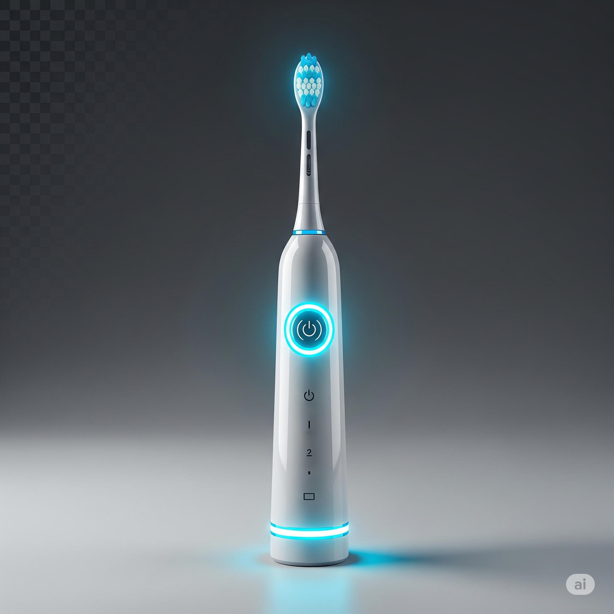

# 🌌 Samsung Galaxy SmartBrush – Landing Page

Welcome to the future of oral care. This is a fully responsive, dark-mode-enabled, animated landing page for the fictional **Samsung Galaxy SmartBrush** series.  
Built with 🔥 using **Tailwind CSS**, vanilla **JavaScript**, and a sprinkle of ✨ animations.

---

## 🚀 Features

- 🌓 **Dark/Light Mode Toggle**  
- 🔍 **Real-Time Search Bar** with live filtering
- 🧠 **Animated Product Cards** that pop with hover & scroll effects
- 🎥 **Video Background Hero Section**
- 🖱️ **Smooth Scrolling Navigation**
- 📩 **Integrated Contact Form** (powered by Formspree)


---

## 🧩 Pages

- `index.html` – The full landing experience  
- `s-ultra.html` – Product page for Brush S Ultra  
- `flipbrush.html` – Product page for FlipBrush  
- `a-series.html` – Product page for Brush A Series

---
checkout the working explained in a video with the link below-
\https://drive.google.com/drive/folders/1MBW9so2g52Do8KWICRWA_ZxfhakPj3VN?usp=drive_link

---
## 📂 Folder Structure

```
📁 assets/
│   ├── logo-light.png
│   ├── logo-dark.png
│   ├── brush-s-ultra-*.png
│   ├── brush-flip-*.png
│   ├── brush-a-*.png
│   └── galaxy-brush-ultra.mp4
📄 index.html
📄 s-ultra.html
📄 flipbrush.html
📄 a-series.html
📄 style.css (optional)
📄 script.js
📄 README.md
```

---

## ⚙️ Tech Stack

- [Tailwind CSS](https://tailwindcss.com)
- [Formspree](https://formspree.io) for backend-less contact form
- Pure HTML, CSS, JavaScript

---

## 📬 Contact Integration

We're using Formspree for the "Contact Us" section at the footer.  
Feel free to replace the action URL with your own Formspree endpoint:
```html
<form action="https://formspree.io/f/xqalelrj" method="POST">
```

---

## 🛠️ Setup

No build tools, no bundlers, no drama. Just clone and open `index.html`.

```bash
git clone https://github.com/rayidafzal/XEON.git
cd XEON
open index.html
```

---

## 👑 Team Xeon

The brains behind the bristles:

- 🧠 **Rayid Mohammed Afzal** *(Frontend, Logic, Visuals, Chaos Control)*  
- 🧠 **Harshendu V Kurup** *(Content, Design Sync, Code Review)*  
- 🧠 **Karthik G.S** *(Script Enhancement, Optimization)*  
- 🧠 **Aleena Susan** *(Testing, UX Tweaks, QA Queen)*  

This project was built with caffeine, collaboration, and way too many Tailwind classes.

---

## 📸 Preview



> "SmartBrush – Not just clean. Galaxy clean."

---

## 📝 License

MIT License — use it, remix it, show us what you build.  
Just don’t mint toothbrush NFTs without brushing your teeth first 😤
